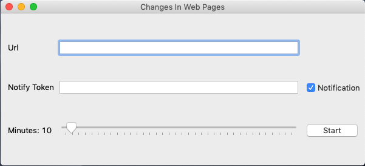

# ChangesInWebPages
---

## Get a notification when a web page changes
you can control changes in web pages and get a notification on your android phone via [Notify](https://www.amazon.it/dp/B084Z7YXRZ/ref=sr_1_6?__mk_it_IT=%C3%85M%C3%85%C5%BD%C3%95%C3%91&keywords=notify&qid=1582193059&sr=8-6). You can find the source code of the app in this [repo](https://github.com/Monti03/Notify).

<p align="center">
  

## Dependencies installation
```bash
$ pip install -r requirements.txt
```

## Usage
  To start just run: `python3 gui.py`
  
## Gui

<p align="center">
  
  
  - Url           -> insert here the url you're checking
  
  - NotifyToken   -> if you have not inserted it yet you have ho insert the token that is shown in the notify app
  
  - Notification  -> check if you whant to have the notification on the phone
  
  - Slider        -> inspection period (minutes)

## Development 

Development environment can be easily set up thanks to provided `Pipfile` with `pipenv`

```bash
$ pipenv install
```